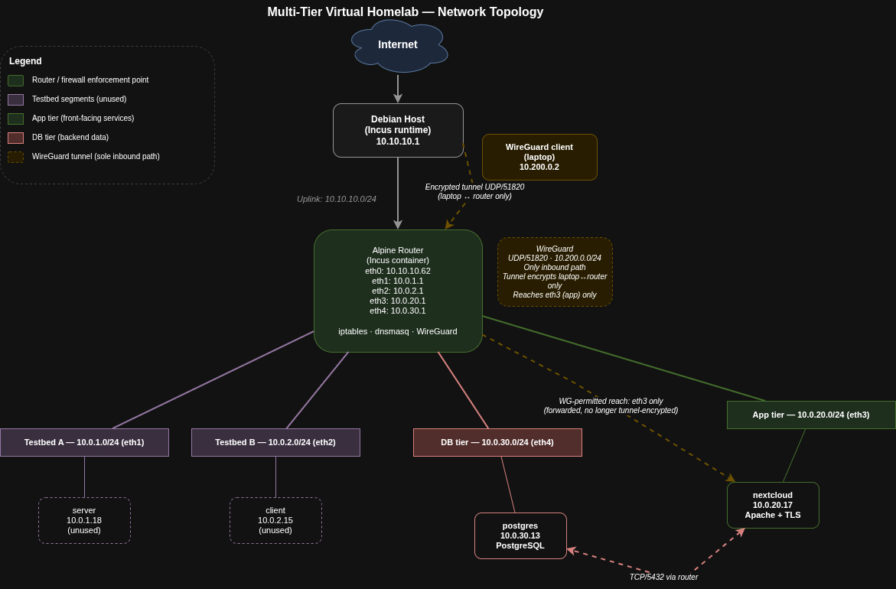

# Multi-Tier Virtual Homelab

A segmented network lab built on Debian using Incus containers and an Alpine Linux router. The lab is designed as a **three-legged firewall** with four internal subnets, a single enforcement point, and WireGuard VPN as the only inbound path.

Built and maintained as a personal learning environment for networking, firewall design, and service deployment fundamentals.

## Topology



```
Internet
   |
Debian Host (10.10.10.1) ── the lab's upstream
   |
Alpine Router Container (10.10.10.62) ── lab edge
   |
   ├── eth1 ── Testbed A     (10.0.1.0/24)
   ├── eth2 ── Testbed B     (10.0.2.0/24)
   ├── eth3 ── App tier      (10.0.20.0/24) ── nextcloud (10.0.20.17)
   └── eth4 ── DB tier       (10.0.30.0/24) ── postgres  (10.0.30.13)
```

From the lab's perspective, the Debian host *is* the internet. The router container's `eth0` faces Debian and MASQUERADEs all outbound traffic through it. Whatever sits upstream of Debian (home router, ISP) is abstracted away.

## Host and Runtime

| | |
|---|---|
| Host | Dell Latitude, i5-8365U, 32 GB RAM, 256 GB SSD |
| OS | Debian (bare metal) |
| Container runtime | Incus |
| Containers | 5 (router, nextcloud, postgres, server, client) |
| Internal networks | 4 |

The lab runs entirely in Incus containers. No VMs, no Docker.

## Architecture Note

This is structurally DMZ-shaped but enforced as a **three-legged firewall**: one router holds all inter-zone rules. A true DMZ requires two enforcement points so that compromise of one layer still leaves another. Adding a second enforcement boundary is on the roadmap.

## Networking

**Routing.** Static only. No dynamic routing protocols. Single router, so OSPF or BGP would add no value here.

**DHCP and DNS.** Both handled by `dnsmasq` on the router.

- DHCP serves eth1 through eth4. Uplink (eth0) is excluded with `no-dhcp-interface=eth0`.
- Pool: `.10` to `.20` of each `/24`. 24-hour leases.
- Gateway (option 3) and DNS (option 6) pushed as the router's IP on each segment.
- DNS is authoritative for `.local`:
  - `nextcloud.local` → `10.0.20.17`
  - `postgres.local` → `10.0.30.13`
- Upstream DNS chain: container → router dnsmasq → Debian host → ISP DNS.

**NAT.** Outbound `MASQUERADE` on `eth0` only. No inbound port forwards from the home LAN. The only inbound path into the lab is WireGuard.

**IPv6.** Incus assigns ULA addresses (`fd42::/64`) to every container, but no `ip6tables` rules are configured. The v6 plane is currently unenforced.

## Firewall

Default policies:

- `INPUT`: ACCEPT
- `OUTPUT`: ACCEPT
- `FORWARD`: **DROP**, this is the segmentation

FORWARD ACCEPT rules:

```
Chain FORWARD (policy DROP)
target  prot  in    out   source           destination  state
ACCEPT  all   wg0   eth3  10.200.0.0/24    0.0.0.0/0
ACCEPT  all   *     *     10.0.0.0/16      0.0.0.0/0
ACCEPT  all   eth0  *     0.0.0.0/0        0.0.0.0/0    RELATED,ESTABLISHED
```

**What this gives:** nothing upstream of the router (including the Debian host itself) can initiate inbound connections to any internal segment. The only inbound path is the WireGuard tunnel.

**What this doesn't give:** internal-to-internal traffic is trusted via the blanket `10.0.0.0/16 → anywhere` rule. Nextcloud reaches Postgres on TCP/5432 through this rule. Per-port tightening between zones is the next obvious step.

## Services

**Nextcloud** (app tier, 10.0.20.17)

- Apache 2.4 on Debian
- DocumentRoot: `/var/www/html/nextcloud`
- Listens on port 443 only as port 80 is closed (see debugging story 1)
- Self-signed cert at `/etc/ssl/certs/nextcloud.crt`
- `overwriteprotocol=https`, `trusted_domains` set

**PostgreSQL** (DB tier, 10.0.30.13)

- Dedicated container on a separate segment from the app
- Used only by Nextcloud
- Cross-segment query path: `eth3 → router → eth4`

**WireGuard** (router)

- UDP/51820
- Tunnel network: `10.200.0.0/24`, router at `10.200.0.1`
- One peer (laptop) at `10.200.0.2`
- A single ACCEPT rule (wg0 → eth3) grants the WG client reach into the app tier only. The other three segments are not reachable over the tunnel.
# Multi-Tier Virtual Homelab

A segmented network lab built on Debian using Incus containers and an Alpine Linux router. The lab is designed as a **three-legged firewall** with four internal subnets, a single enforcement point, and WireGuard VPN as the only inbound path.

Built and maintained as a personal learning environment for networking, firewall design, and service deployment fundamentals.

## Topology


```
Internet
   |
Debian Host (10.10.10.1) ── the lab's upstream
   |
Alpine Router Container (10.10.10.62) ── lab edge
   |
   ├── eth1 ── Testbed A     (10.0.1.0/24)
   ├── eth2 ── Testbed B     (10.0.2.0/24)
   ├── eth3 ── App tier      (10.0.20.0/24) ── nextcloud (10.0.20.17)
   └── eth4 ── DB tier       (10.0.30.0/24) ── postgres  (10.0.30.13)
```

From the lab's perspective, the Debian host *is* the internet. The router container's `eth0` faces Debian and MASQUERADEs all outbound traffic through it. Whatever sits upstream of Debian (home router, ISP) is abstracted away.

## Host and Runtime

| | |
|---|---|
| Host | Dell Latitude, i5-8365U, 32 GB RAM, 256 GB SSD |
| OS | Debian (bare metal) |
| Container runtime | Incus |
| Containers | 5 (router, nextcloud, postgres, server, client) |
| Internal networks | 4 |

The lab runs entirely in Incus containers. No VMs, no Docker.

## Architecture Note

This is structurally DMZ-shaped but enforced as a **three-legged firewall**: one router holds all inter-zone rules. A true DMZ requires two enforcement points so that compromise of one layer still leaves another. Adding a second enforcement boundary is on the roadmap.

## Networking

**Routing.** Static only. No dynamic routing protocols. Single router, so OSPF or BGP would add no value here.

**DHCP and DNS.** Both handled by `dnsmasq` on the router.

- DHCP serves eth1 through eth4. Uplink (eth0) is excluded with `no-dhcp-interface=eth0`.
- Pool: `.10` to `.20` of each `/24`. 24-hour leases.
- Gateway (option 3) and DNS (option 6) pushed as the router's IP on each segment.
- DNS is authoritative for `.local`:
  - `nextcloud.local` → `10.0.20.17`
  - `postgres.local` → `10.0.30.13`
- Upstream DNS chain: container → router dnsmasq → Debian host → ISP DNS.

**NAT.** Outbound `MASQUERADE` on `eth0` only. No inbound port forwards from the home LAN. The only inbound path into the lab is WireGuard.

**IPv6.** Incus assigns ULA addresses (`fd42::/64`) to every container, but no `ip6tables` rules are configured. The v6 plane is currently unenforced.

## Firewall

Default policies:

- `INPUT`: ACCEPT
- `OUTPUT`: ACCEPT
- `FORWARD`: **DROP**, this is the segmentation

FORWARD ACCEPT rules:

```
Chain FORWARD (policy DROP)
target  prot  in    out   source           destination  state
ACCEPT  all   wg0   eth3  10.200.0.0/24    0.0.0.0/0
ACCEPT  all   *     *     10.0.0.0/16      0.0.0.0/0
ACCEPT  all   eth0  *     0.0.0.0/0        0.0.0.0/0    RELATED,ESTABLISHED
```

**What this gives:** nothing upstream of the router (including the Debian host itself) can initiate inbound connections to any internal segment. The only inbound path is the WireGuard tunnel.

**What this doesn't give:** internal-to-internal traffic is trusted via the blanket `10.0.0.0/16 → anywhere` rule. Nextcloud reaches Postgres on TCP/5432 through this rule. Per-port tightening between zones is the next obvious step.

## Services

**Nextcloud** (app tier, 10.0.20.17)

- Apache 2.4 on Debian
- DocumentRoot: `/var/www/html/nextcloud`
- Listens on port 443 only as port 80 is closed (see debugging story 1)
- Self-signed cert at `/etc/ssl/certs/nextcloud.crt`
- `overwriteprotocol=https`, `trusted_domains` set

**PostgreSQL** (DB tier, 10.0.30.13)

- Dedicated container on a separate segment from the app
- Used only by Nextcloud
- Cross-segment query path: `eth3 → router → eth4`

**WireGuard** (router)

- UDP/51820
- Tunnel network: `10.200.0.0/24`, router at `10.200.0.1`
- One peer (laptop) at `10.200.0.2`
- A single ACCEPT rule (wg0 → eth3) grants the WG client reach into the app tier only. The other three segments are not reachable over the tunnel.

## What broke

Three problems worth reading about. Full writeups on the blog: [link].

- WireGuard does not encrypt end to end. A capture on `wg0` showed a Nextcloud password in cleartext until I forced TLS at the app layer. The tunnel protects the hop, not the application.
- A WG peer silently failed to register. Two bugs at once: the client public key was a copy of the server's, and `AllowedIps` was miscased (it must be `AllowedIPs`). wg-quick ignores both without warning.
- I locked myself out by closing port 80. Browsers default to `http://` for bare IPs, so the tightened Apache config looked broken when it was actually working.

## Roadmap

**Committed:**
Close the architectural gaps this README documents:

- Add a second enforcement point between the app and DB tiers, converting the three-legged firewall into a true DMZ. Compromise of the front tier no longer means flat access to the backend.
- Replace the blanket `10.0.0.0/16 -> anywhere` rule with per-port rules between zones (app to DB on 5432 only, etc).


## Tech Stack

`Debian` · `Incus` · `Alpine Linux` · `iptables` · `dnsmasq` · `WireGuard` · `Apache` · `Nextcloud` · `PostgreSQL` · `OpenSSL`

---

Maintained by Rudra Patel. Built as a learning environment, documented honestly.